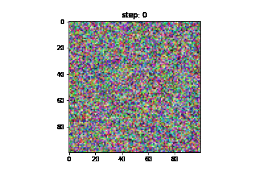

# Kohonen Challenge




Please see [kohonen.ipynb](kohonen.ipynb) for the show case

# Run Demo (for fun)
```
docker build -t kohonen2 .
docker run -p 8887:8888 kohonen2 jupyter notebook --ip 0.0.0.0 --allow-root
```

Or you can use docker-compose, which also mount current folder 
```bash
docker-compose up
```
Then you may find your vlogs under `./logs2`

# Run training (for big/serious job)
## with container
```bash
docker run kohonen2 ksom train --config-file "configs/exp1.yaml"
# or running in interactive mode
docker run -it kohonen2 ksom train --config-file "configs/exp1.yaml"
```

## without container

```bash
pip3 install -e .
ksom train --config-file "configs/exp1.yaml"
```
If config_file is not provided it will use default configuration


# Design Thinking

For simplicity this project is mainly using `numpy`. 
Other dependencies are for the purpose of logging, configuration, cli tools etc.

## Feature Summary:
1. **experiment as yaml**: all the experiment configs (hparams etc.) should goes here, 
such that we can always use yaml to reproduce experiments.

2. **Modular design**: 5 major module - [Trainer](ksom/trainer.py), 
[Model](ksom/kohonensom_model.py), [config](ksom/config.py) 
, [Dataset](ksom/dataset.py) & [hooks](ksom/hooks.py).
Trainer is the coordinator of the entire training job 
and interact with other modules like hooks.

3. **extensible**: Modules are highly extensive - one may extend their own CustomDataset based on `Dataset` 
(see [dataset.py](ksom/dataset.py)); one may also extend `Hook` to build a checkpointor which dump checkpoint 
every N steps

4. **cli interface (easy, lazy)**: see section *Run training* above

5. **vlog system (Visibility makes models more explainable)**: take a photo of current weight 
every N steps (defined as `cfg.CALLBACK_PERIOD`). 
[Vlog](ksom/hooks.py) output is saved to `kohonen2/logs/${exp_name}`
exp_name is same as `.yaml` config filename. 
Each experiment will produce a vlog.gif to visualise the training process. 
Given that SOM does not really have a loss function to monitor the training, 
visualise the weights at different stages would be a good alternative for 
training monitoring.

```
|---configs: containing yaml file for different experiment settings
|---ksom: main folder of source code
    |---config.py: yaml configuration system
    |---dataset.py: Dataset that generate random colors
    |---default_setup.py: setting for training job and prepare confiigurations
    |---entry.py: connect cli to python program
    |---hooks.py: the callback used during training, can be extended to log iter time, logging, periodic checkpoint 
    |---kohonensom_model.py: the actual model
    |---logger.py: logging system
    |---trainer.py: defining Trainer - the coordinator of the training ob
|---Dockerfile:
|---setup.py: 
```

# Acknowledgement & Reference
- There are many good implementation of SOM on the Internet. e.g. [[1]](https://medium.com/kirey-group/self-organizing-maps-with-fast-ai-step-1-implementing-a-som-with-pytorch-80df2216ede3)
